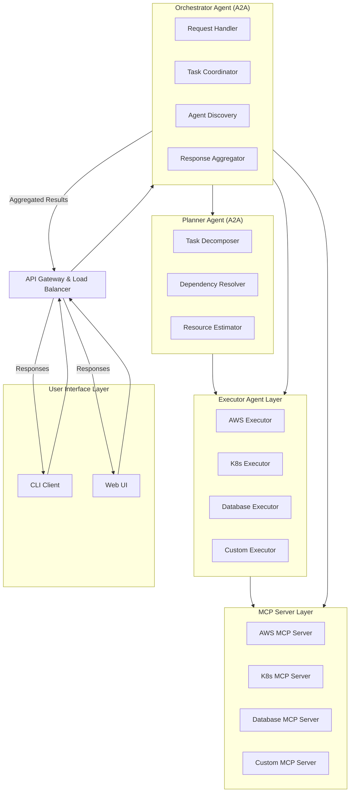

# CloudBrain Agents

A comprehensive suite of intelligent agents for DevOps and cloud operations, built on modern AI frameworks and protocols. This repository serves as the **central hub for all agents** designed to orchestrate, plan, and execute complex infrastructure and deployment workflows.

Each agent is designed to work independently or as part of a larger orchestrated system, providing specialized capabilities for different aspects of DevOps operations. The agents leverage the **Google A2A Protocol** for seamless communication and integrate with various **MCP Servers** for tool-specific operations.

## Table of Contents

- [CloudBrain Agents](#cloudbrain-agents)
  - [Table of Contents](#table-of-contents)
  - [Available Agents](#available-agents)
    - [Planner Agent](#planner-agent)
  - [Architecture Overview](#architecture-overview)
  - [Technology Stack](#technology-stack)
  - [Installation and Setup](#installation-and-setup)
  - [Contributing](#contributing)
  - [License](#license)

## Available Agents

### Planner Agent

The **Planner Agent** is responsible for decomposing complex user requests into actionable tasks and creating execution plans. It leverages advanced AI models to understand dependencies, estimate resources, and optimize task sequences.

- **Task Decomposition**
  - Breaks down complex requests into manageable tasks
  - Identifies dependencies and execution order
  - Estimates resource requirements and timeframes
- **Intelligent Planning**
  - Uses AI models for context-aware planning
  - Optimizes task sequences for efficiency
  - Handles dynamic task dependencies
- **Resource Management**
  - Estimates resource requirements for tasks
  - Optimizes resource allocation across agents
  - Monitors resource utilization and availability

[Learn more](src/planner-agent/README.md)

## Architecture Overview

The CloudBrain Agents platform follows a layered architecture where each agent has specific responsibilities:

### Key Components

- **Orchestrator Agent**: Central coordination and request handling
- **Planner Agent**: Task decomposition and planning
- **Executor Agents**: Specialized agents for specific domains (AWS, Kubernetes, etc.)
- **MCP Servers**: Tool-specific interfaces for infrastructure operations
- **API Gateway**: Load balancing and request routing
- **User Interfaces**: CLI and Web UI for user interactions

## Technology Stack

### Core Technologies
- **Language**: Python 3.12+
- **Agent Communication**: Google A2A Protocol
- **MCP Communication**: Anthropic MCP Protocol
- **Agent Framework**: Langchain, LangGraph
- **Data Validation**: Pydantic v2+

### Individual Agent Setup
Each agent has specific installation instructions. See each agent's detailed README for specific requirements and configuration options:
- [Planner Agent Setup](src/planner-agent/README.md)

## Contributing

I welcome contributions! Please see the following guidelines:

- Fork the repository and create a feature branch
- Write clear, well-documented code and tests
- Ensure all checks pass before submitting a PR
- For major changes, open an issue to discuss your proposal first
- Follow the established code style and architecture patterns

### Development Guidelines
- Each agent should be self-contained with its own configuration
- Use the established A2A protocol for inter-agent communication
- Implement comprehensive logging and monitoring
- Follow security best practices for authentication and authorization

## License

This project is licensed under the GNU General Public License v2 - see the [LICENSE](LICENSE) file for details.
