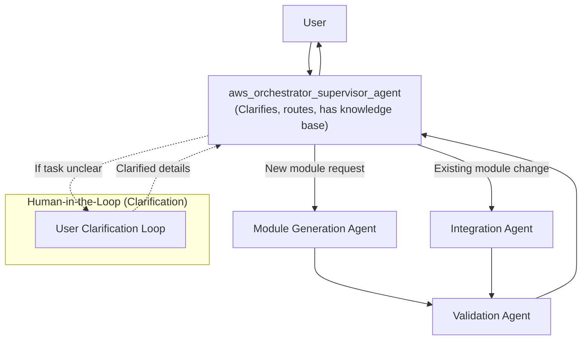

# AWS Orchestrator Agent

## Multi-Agent LangGraph Workflow

This project implements a modular, multi-agent orchestration system for Terraform module generation and integration, using LangGraph and the A2A protocol.

### Workflow Overview

### Flow Explanation
- **User** contacts the `aws_orchestrator_supervisor_agent`.
- **Supervisor agent** clarifies requirements with the user if the task is unclear (human-in-the-loop), has access to the knowledge base, and routes the request:
  - To **Module Generation Agent** for new modules.
  - To **Integration Agent** for existing module changes.
- After either generation or integration, the **Validation Agent** is always invoked.
- The **Validation Agent** returns results to the supervisor, which then responds to the user.
