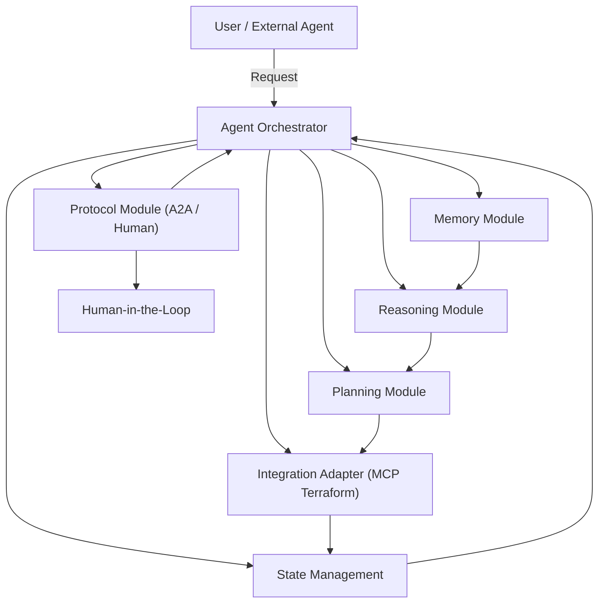

# Agent Framework Architecture

## Overview
This document describes the modular architecture for the AWS Orchestrator Agent framework, focusing on extensibility, clear interfaces, and support for advanced features such as Google A2A protocol, LangGraph Pydantic schemas, state management, human-in-the-loop, and MCP Terraform integration.

---

## Core Components
- **Agent Orchestrator**: Main entry point, coordinates all modules.
- **Reasoning Module**: Handles decision-making and logic.
- **Planning Module**: Generates and manages action plans.
- **Memory Module**: Stores short-term and long-term context.
- **Protocol Module (A2A)**: Manages agent-to-agent and human-in-the-loop communication.
- **State Management**: Maintains agent state, including goals, memory, and plan progress.
- **Integration Adapters**: Interfaces for external systems (e.g., MCP Terraform server).

---

## Interfaces
- **Agent Orchestrator**
  - `process_request(input) -> output`
  - `update_state(state_update)`
- **Reasoning Module**
  - `decide_action(context) -> action`
- **Planning Module**
  - `generate_plan(goal, context) -> plan`
  - `update_plan(feedback)`
- **Memory Module**
  - `store(memory_record)`
  - `retrieve(query) -> memory_record`
- **Protocol Module (A2A)**
  - `send_message(message)`
  - `receive_message() -> message`
  - `handle_human_input(input)`
- **State Management**
  - `get_state() -> state`
  - `set_state(state)`
- **Integration Adapters**
  - `deploy_infrastructure(plan)`
  - `fetch_status(resource_id)`

---

## Data Flow
1. **User/Agent Input**: Received by Agent Orchestrator.
2. **Reasoning**: Orchestrator invokes Reasoning Module to decide next action.
3. **Planning**: Planning Module generates or updates the plan.
4. **Memory**: Context and results are stored/retrieved as needed.
5. **Protocol (A2A/Human-in-the-Loop)**: Communication with other agents or humans as required.
6. **Integration**: Actions (e.g., infrastructure deployment) are executed via adapters.
7. **State Update**: State Management updates and persists the agent's state.
8. **Output**: Response returned to user or next agent.

---

## Extensibility Points
- **Protocols**: Add new communication protocols by implementing the Protocol Module interface.
- **Memory**: Support new memory backends or strategies by extending the Memory Module.
- **Planning/Reasoning**: Swap or enhance planning/reasoning logic via their interfaces.
- **Integrations**: Add new infrastructure backends (e.g., other cloud providers) via Integration Adapters.
- **Human-in-the-Loop**: Easily enable/disable or extend human intervention points in the protocol module.

---

## Architecture Diagram

---

## Notes
- All data models (inputs, outputs, state, memory) should use Pydantic schemas for type safety and validation.
- The architecture is designed for modularity and future extensibility.
- Human-in-the-loop can be triggered at any protocol step for oversight or manual intervention.
- MCP Terraform integration is abstracted for easy replacement or extension. 