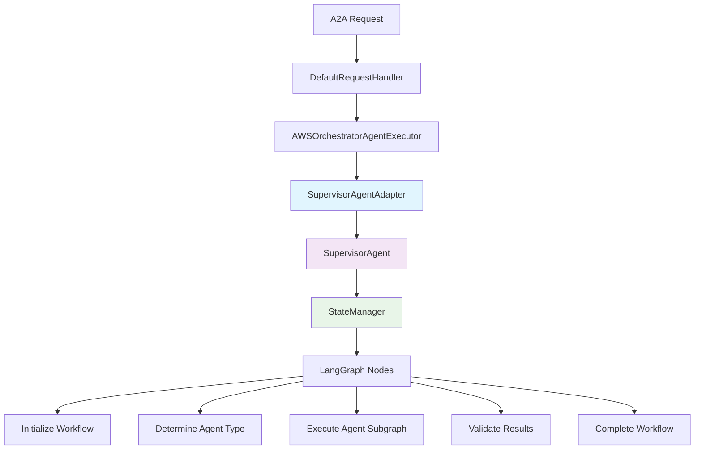

# Server Integration Example

## Overview

This document shows how to run the AWS Orchestrator Agent server with the Supervisor Agent integration, following the pattern from the reference `agent_manager.py`.

## Integration Flow



## Server Setup

### 1. Basic Server Startup

```bash
# Start the server with default configuration
python aws_orchestrator_agent/server.py \
  --host localhost \
  --port 10102 \
  --agent-card agent_card.json
```

### 2. Custom Configuration

```bash
# Start with custom model and configuration
python aws_orchestrator_agent/server.py \
  --host 0.0.0.0 \
  --port 10102 \
  --agent-card agent_card.json \
  --model-name "openai:gpt-4o-mini" \
  --config-file custom_config.json
```

### 3. Custom Configuration File

Create `custom_config.json`:
```json
{
  "model_name": "openai:gpt-4o-mini",
  "max_snapshots": 20,
  "default_agent_timeout": 180,
  "human_approval_required": [
    "terraform_apply",
    "security_violations",
    "cost_threshold_exceeded"
  ],
  "validation_always_required": [
    "terraform_generation",
    "terraform_modification"
  ]
}
```

## Code Integration Pattern

### 1. Server Initialization

```python
# In server.py - Key integration points:

# 1. Create Supervisor Agent
supervisor_agent = SupervisorAgent(
    model_name=config["model_name"],
    config=config
)

# 2. Create Supervisor Agent Adapter
adapter = create_supervisor_agent_adapter(
    supervisor_agent=supervisor_agent,
    name="aws-orchestrator-supervisor",
    config={
        "enable_audit_trail": True,
        "max_concurrent_workflows": 10,
        "workflow_timeout": 300
    }
)

# 3. Initialize the adapter
asyncio.run(adapter.initialize())

# 4. Create Task Lifecycle Manager
task_lifecycle_manager = TaskLifecycleManager()

# 5. Create A2A Executor with our adapter
executor = AWSOrchestratorAgentExecutor(
    agent=adapter,
    task_lifecycle_manager=task_lifecycle_manager
)

# 6. Create request handler
request_handler: DefaultRequestHandler = DefaultRequestHandler(
    agent_executor=executor,
    task_store=InMemoryTaskStore(),
    push_notifier=InMemoryPushNotifier(client),
)
```

### 2. Graph-Based Workflow

The `SupervisorAgentAdapter` uses a LangGraph-based workflow:

```python
# Graph nodes in SupervisorAgentAdapter:
graph.add_node("initialize_workflow", self._initialize_workflow_node)
graph.add_node("determine_agent_type", self._determine_agent_type_node)
graph.add_node("execute_agent_subgraph", self._execute_agent_subgraph_node)
graph.add_node("validate_results", self._validate_results_node)
graph.add_node("complete_workflow", self._complete_workflow_node)
```

### 3. State Management

Each workflow uses `SupervisorAgentState`:

```python
class SupervisorAgentState:
    def __init__(
        self,
        messages: list = None,
        user_query: str = "",
        context_id: str = "",
        task_id: str = "",
        resume_value: Any = None,
        next: Optional[str] = None,
        status: str = "working",
        agent_type: Optional[str] = None,
        workflow_id: Optional[str] = None,
        current_step: str = "initialized",
        final_response: Optional[str] = None,
        error: Optional[str] = None
    ):
        # State management for workflow execution
```

## Testing the Integration

### 1. Start the Server

```bash
# Terminal 1: Start the server
python aws_orchestrator_agent/server.py \
  --host localhost \
  --port 10102 \
  --agent-card agent_card.json
```

### 2. Test A2A Request

```bash
# Terminal 2: Test with curl
curl -X POST http://localhost:10102/a2a \
  -H "Content-Type: application/json" \
  -d '{
    "jsonrpc": "2.0",
    "id": 1,
    "method": "run_task",
    "params": {
      "query": "Create a VPC with subnets and security groups",
      "context_id": "test-context-123",
      "task_id": "test-task-456"
    }
  }'
```

### 3. Monitor Workflow Progress

```python
# Python client example
import asyncio
import httpx

async def test_supervisor_agent():
    async with httpx.AsyncClient() as client:
        response = await client.post(
            "http://localhost:10102/a2a",
            json={
                "jsonrpc": "2.0",
                "id": 1,
                "method": "run_task",
                "params": {
                    "query": "Analyze my current AWS infrastructure",
                    "context_id": "test-context",
                    "task_id": "test-task"
                }
            }
        )
        print(response.json())

# Run the test
asyncio.run(test_supervisor_agent())
```

## Workflow Execution Example

### 1. Request Flow

```
User Request: "Create a VPC with subnets"
↓
A2A Request → DefaultRequestHandler
↓
AWSOrchestratorAgentExecutor.execute()
↓
SupervisorAgentAdapter.stream()
↓
LangGraph Graph Execution:
  - initialize_workflow_node
  - determine_agent_type_node (→ GENERATION)
  - execute_agent_subgraph_node
  - validate_results_node
  - complete_workflow_node
↓
A2A Response with results
```

### 2. State Transitions

```
Initial State:
├── user_query: "Create a VPC with subnets"
├── current_step: "initialized"
└── status: "working"

After Agent Type Determination:
├── agent_type: "generation"
├── current_step: "agent_type_determined"
└── status: "working"

After Subgraph Execution:
├── current_step: "subgraph_executed"
├── final_response: "Generated Terraform code..."
└── status: "working"

After Validation:
├── current_step: "validation_complete"
└── status: "working"

Final State:
├── current_step: "completed"
└── status: "completed"
```

### 3. Response Examples

#### Working Status
```json
{
  "response_type": "text",
  "is_task_complete": false,
  "require_user_input": false,
  "content": "Processing... Step: agent_type_determined",
  "metadata": {
    "session_id": "test-context",
    "task_id": "test-task",
    "agent_name": "aws-orchestrator-supervisor",
    "step_count": 2,
    "status": "working",
    "current_step": "agent_type_determined"
  }
}
```

#### Completion Status
```json
{
  "response_type": "data",
  "is_task_complete": true,
  "require_user_input": false,
  "content": {
    "status": "completed",
    "agent_type": "generation",
    "current_step": "completed",
    "final_response": "Generated Terraform code for VPC..."
  },
  "metadata": {
    "session_id": "test-context",
    "task_id": "test-task",
    "agent_name": "aws-orchestrator-supervisor",
    "step_count": 5,
    "status": "completed"
  }
}
```

## Benefits of This Integration

### 1. **Protocol Compliance**
- Full A2A protocol compliance
- Standard agent interface
- Compatible with existing A2A infrastructure

### 2. **Graph-Based Workflow**
- LangGraph-powered state management
- Clear workflow stages
- Conditional branching logic

### 3. **State Management**
- Robust state orchestration
- Audit trails and snapshots
- Error recovery and rollback

### 4. **Observability**
- Complete workflow visibility
- Progress tracking
- Debugging support

### 5. **Extensibility**
- Easy to add new workflow nodes
- Configurable routing logic
- Custom workflow patterns

## Troubleshooting

### 1. Common Issues

#### Model Initialization Error
```
Error: LLM initialization failed
```
**Solution**: Check your API keys and model configuration

#### Graph Compilation Error
```
Error: Failed to build graph
```
**Solution**: Ensure all required dependencies are installed

#### State Management Error
```
Error: State validation failed
```
**Solution**: Check state schema definitions

### 2. Debug Mode

Enable debug logging:
```python
import logging
logging.basicConfig(level=logging.DEBUG)
```

### 3. State Inspection

```python
# Get workflow progress
progress = adapter.get_workflow_progress(task_id)
print(progress)

# Get active workflows
active = adapter.get_active_workflows()
print(active)
```

This integration provides a solid foundation for building complex, reliable, and maintainable multi-agent systems that are fully compatible with the A2A protocol ecosystem. 