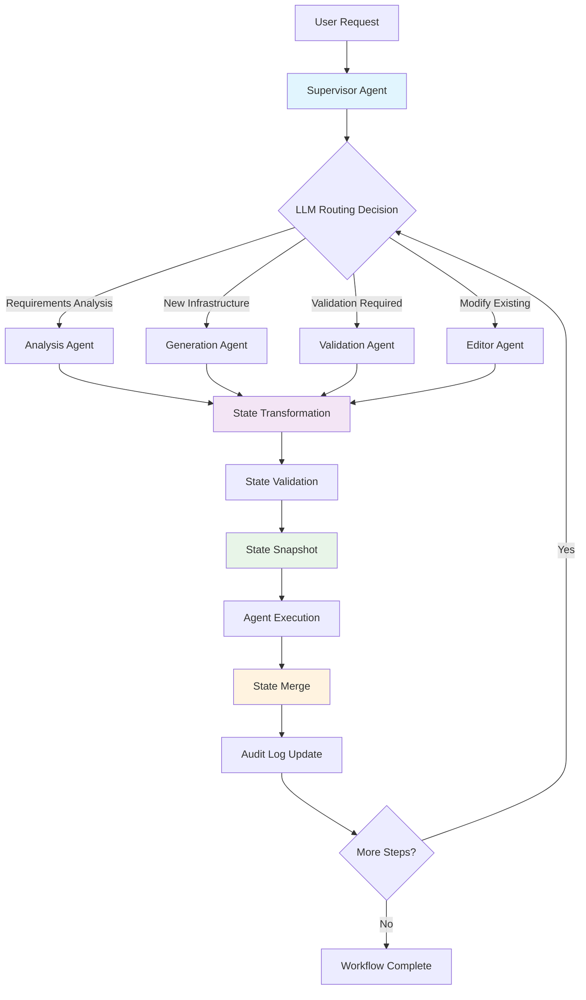
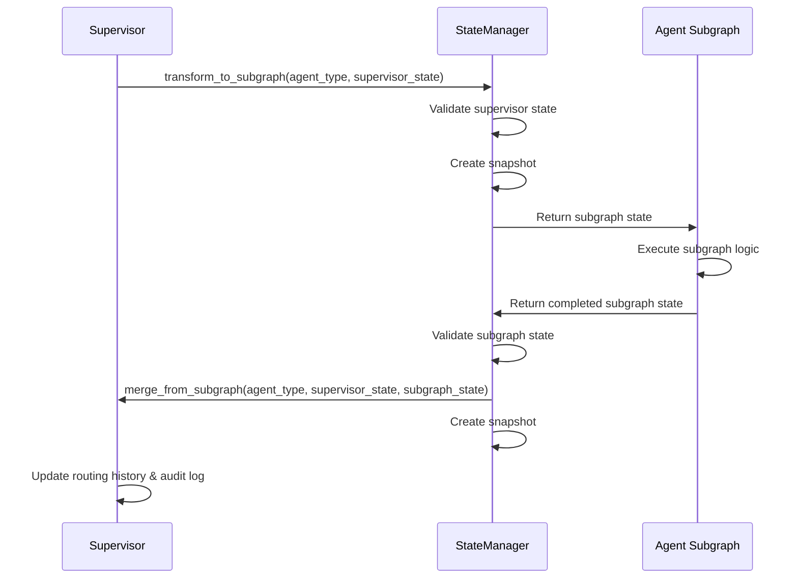

# Supervisor Agent Architecture & State Management

## Overview

The AWS Orchestrator Agent implements a **Supervisor Pattern with Tool-Calling** using LangGraph's supervisor framework. This architecture provides intelligent routing, robust state management, and seamless handoffs between specialized agent subgraphs.

## Architecture Components

### 1. Supervisor Agent
The central orchestrator that:
- Makes intelligent routing decisions using LLM-powered logic
- Manages workflow state and transitions
- Coordinates handoffs between specialized agents
- Provides audit trails and error recovery

### 2. Specialized Agent Subgraphs
Four specialized agents implemented as LangGraph subgraphs:
- **Analysis Agent**: Requirements gathering, conversation management, AWS context retrieval
- **Generation Agent**: Creates new Terraform modules from scratch with best practices
- **Validation Agent**: Comprehensive validation (syntax, plan, security, compliance)
- **Editor Agent**: Modifies existing Terraform configurations with surgical precision

### 3. State Management System
Robust state orchestration using:
- **StateManager**: Central coordinator for all state transformations
- **Pydantic Models**: Type-safe state schemas for all agents
- **State Transformations**: Bidirectional mapping between supervisor and subgraph states
- **Snapshot Management**: Audit trails and rollback capabilities

## Workflow Flow



## State Management Architecture

### State Schema Hierarchy

```
SupervisorState (Parent)
├── AnalysisState (Subgraph)
├── GenerationState (Subgraph)
├── ValidationState (Subgraph)
└── EditorState (Subgraph)
```

### State Transformation Flow



## Handoff Mechanisms

### 1. LLM-Powered Routing
The Supervisor Agent uses an LLM to make intelligent routing decisions:

```python
# Routing Logic in Supervisor Agent
def route_request(user_request: str) -> AgentType:
    """
    LLM analyzes the request and determines the appropriate agent:
    - Analysis: requirements gathering, conversation, context retrieval
    - Generation: creating new Terraform modules
    - Validation: validating Terraform code, security, compliance
    - Editor: modifying existing configurations
    """
```

### 2. State Handoffs
Each handoff involves:

1. **State Transformation**: Supervisor state → Subgraph state
2. **Validation**: Ensure state integrity and dependencies
3. **Snapshot Creation**: Audit trail for rollback
4. **Agent Execution**: Subgraph processes the request
5. **State Merge**: Subgraph state → Supervisor state
6. **Audit Update**: Log the handoff and results

### 3. Error Handling & Rollback
- **Automatic Rollback**: On subgraph failure, rollback to last known good state
- **Error Context**: Capture detailed error information for debugging
- **Retry Logic**: Attempt retries for transient failures
- **Human Escalation**: Escalate to human intervention when needed

## State Management Details

### SupervisorState Schema
```python
class SupervisorState(BaseModel):
    # Core workflow state
    workflow_id: str
    current_step: str
    status: WorkflowStatus  # PENDING, IN_PROGRESS, COMPLETED, FAILED, etc.
    
    # Request context
    user_request: str
    mcp_context: Dict[str, Any]
    
    # Agent subgraph states (namespaced)
    analysis_state: Optional[AnalysisState]
    generation_state: Optional[GenerationState]
    validation_state: Optional[ValidationState]
    editor_state: Optional[EditorState]
    
    # Orchestration metadata
    routing_history: List[Dict[str, Any]]
    error_context: Dict[str, Any]
    audit_log: List[Dict[str, Any]]
    
    # Human-in-the-loop
    human_approval_required: bool
    approval_context: Optional[Dict[str, Any]]
    
    # Performance tracking
    total_execution_time: float
    agent_execution_times: Dict[str, float]
```

### Agent State Schemas
Each specialized agent has its own state schema:

```python
class AnalysisState(BaseModel):
    query: str
    conversation_history: List[Dict[str, Any]]
    requirements: Dict[str, Any]
    aws_context: Dict[str, Any]
    analysis_complete: bool
    confidence_score: float

class GenerationState(BaseModel):
    module_name: str
    requirements: Dict[str, Any]
    generated_files: List[str]
    terraform_code: Dict[str, str]
    generation_complete: bool

class ValidationState(BaseModel):
    terraform_code: Dict[str, str]
    validation_reports: Dict[str, Any]
    security_scan_results: Dict[str, Any]
    compliance_results: Dict[str, Any]
    validation_complete: bool
    overall_score: float

class EditorState(BaseModel):
    original_code: Dict[str, str]
    modifications: Dict[str, Any]
    modified_code: Dict[str, str]
    surgical_changes: List[Dict[str, Any]]
    editor_complete: bool
```

## State Transformation Functions

### Input Transformations (Supervisor → Subgraph)
```python
def supervisor_to_analysis_state(supervisor_state: SupervisorState) -> AnalysisState:
    """Extract relevant data from supervisor state for analysis agent"""
    return AnalysisState(
        query=supervisor_state.user_request,
        conversation_history=supervisor_state.routing_history,
        aws_context=supervisor_state.mcp_context.get("aws_context", {})
    )

def supervisor_to_generation_state(supervisor_state: SupervisorState) -> GenerationState:
    """Extract requirements from analysis state for generation agent"""
    return GenerationState(
        module_name=supervisor_state.user_request,
        requirements=supervisor_state.analysis_state.requirements
    )
```

### Output Transformations (Subgraph → Supervisor)
```python
def analysis_to_supervisor_state(supervisor_state: SupervisorState, analysis_state: AnalysisState) -> SupervisorState:
    """Merge analysis results back into supervisor state"""
    updated_supervisor = supervisor_state.model_copy(deep=True)
    updated_supervisor.analysis_state = analysis_state
    updated_supervisor.add_routing_entry("analysis", "completed")
    updated_supervisor.add_audit_entry("analysis_completed", {...})
    return updated_supervisor
```

## StateManager Orchestration

The StateManager provides a unified interface for all state operations:

```python
class StateManager:
    def transform_to_subgraph(self, agent_type: AgentType, supervisor_state: SupervisorState) -> Any:
        """Transform supervisor state to subgraph input state"""
        
    def merge_from_subgraph(self, agent_type: AgentType, supervisor_state: SupervisorState, subgraph_state: Any) -> SupervisorState:
        """Merge subgraph output state back into supervisor state"""
        
    def validate_state(self, state: Any) -> bool:
        """Validate state for schema compliance and business rules"""
        
    def create_snapshot(self, supervisor_state: SupervisorState, description: str) -> StateSnapshot:
        """Create state snapshot for audit trail and rollback"""
        
    def rollback_to_snapshot(self, supervisor_state: SupervisorState, snapshot_index: int = -1) -> SupervisorState:
        """Rollback to previous state snapshot"""
```

## Workflow Execution Example

### 1. User Request: "Create a VPC with subnets"

```python
# Initialize workflow
supervisor.initialize_workflow("Create a VPC with subnets", {"aws_region": "us-west-2"})

# Route to Analysis Agent
analysis_state = supervisor.state_manager.transform_to_subgraph(AgentType.ANALYSIS, supervisor.supervisor_state)
# Analysis Agent processes request and extracts requirements
supervisor.supervisor_state = supervisor.state_manager.merge_from_subgraph(AgentType.ANALYSIS, supervisor.supervisor_state, analysis_state)

# Route to Generation Agent
generation_state = supervisor.state_manager.transform_to_subgraph(AgentType.GENERATION, supervisor.supervisor_state)
# Generation Agent creates Terraform code
supervisor.supervisor_state = supervisor.state_manager.merge_from_subgraph(AgentType.GENERATION, supervisor.supervisor_state, generation_state)

# Route to Validation Agent
validation_state = supervisor.state_manager.transform_to_subgraph(AgentType.VALIDATION, supervisor.supervisor_state)
# Validation Agent validates the code
supervisor.supervisor_state = supervisor.state_manager.merge_from_subgraph(AgentType.VALIDATION, supervisor.supervisor_state, validation_state)
```

### 2. State Evolution Throughout Workflow

```
Initial State:
├── user_request: "Create a VPC with subnets"
├── status: PENDING
└── current_step: "initialized"

After Analysis:
├── analysis_state: {requirements: {"vpc": true, "subnets": 2}, analysis_complete: true}
├── status: IN_PROGRESS
└── current_step: "analysis"

After Generation:
├── generation_state: {terraform_code: {"main.tf": "..."}, generation_complete: true}
├── status: IN_PROGRESS
└── current_step: "generation"

After Validation:
├── validation_state: {overall_score: 95.0, validation_complete: true}
├── status: COMPLETED
└── current_step: "validation"
```

## Audit Trail & Observability

### Snapshot Management
- **Automatic Snapshots**: Created before/after each major state transition
- **Rollback Points**: Enable recovery from failures
- **Audit Trail**: Complete history of state changes

### Progress Tracking
```python
progress = supervisor.get_workflow_progress()
# Returns:
{
    "workflow_id": "uuid",
    "current_step": "generation",
    "status": "IN_PROGRESS",
    "completion_percentage": 75.0,
    "agent_execution_times": {"analysis": 2.5, "generation": 1.8},
    "agent_states": {
        "analysis": {"exists": true, "complete": true},
        "generation": {"exists": true, "complete": false},
        "validation": {"exists": false, "complete": false},
        "editor": {"exists": false, "complete": false}
    }
}
```

### Debugging Support
```python
debug_data = supervisor.export_state_for_debugging()
# Returns complete state dump for debugging and analysis
```

## Error Handling & Recovery

### Error Scenarios
1. **Subgraph Failure**: Automatic rollback to last known good state
2. **State Validation Failure**: Detailed error context and recovery suggestions
3. **Network Issues**: Retry logic with exponential backoff
4. **Human Approval Required**: Pause workflow and wait for user input

### Recovery Mechanisms
```python
# Automatic rollback on failure
try:
    result = supervisor.invoke_agent_subgraph(AgentType.GENERATION)
except Exception as e:
    # StateManager automatically rolls back to previous snapshot
    supervisor.supervisor_state = supervisor.state_manager.rollback_to_snapshot(supervisor.supervisor_state)
```

## Benefits of This Architecture

### 1. **Separation of Concerns**
- Each agent specializes in one domain
- Clear boundaries between responsibilities
- Easy to test and maintain individual components

### 2. **Robust State Management**
- Type-safe state schemas with Pydantic
- Automatic validation and error detection
- Complete audit trails and rollback capabilities

### 3. **Intelligent Routing**
- LLM-powered decision making
- Context-aware agent selection
- Flexible workflow adaptation

### 4. **Observability**
- Complete workflow visibility
- Detailed progress tracking
- Comprehensive debugging support

### 5. **Error Recovery**
- Automatic rollback mechanisms
- Graceful failure handling
- Human-in-the-loop escalation

### 6. **Scalability**
- Easy to add new specialized agents
- Modular architecture
- Independent agent development

## Future Enhancements

### 1. **Parallel Execution**
- Execute independent agents in parallel
- Merge results using reducer functions
- Optimize workflow performance

### 2. **Advanced Routing**
- Multi-agent routing decisions
- Dynamic workflow adaptation
- Learning from past decisions

### 3. **Enhanced Observability**
- Real-time workflow monitoring
- Performance analytics
- Predictive failure detection

### 4. **Integration Points**
- MCP adapter nodes for external tools
- Webhook notifications
- External system integrations

This architecture provides a solid foundation for building complex, reliable, and maintainable multi-agent systems for AWS infrastructure orchestration. 