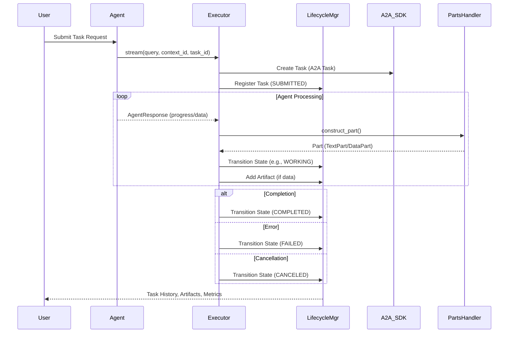

# Task Lifecycle: End-to-End Flow in AWS Orchestrator Agent

## Overview
This document describes the complete lifecycle of a task in the AWS Orchestrator Agent system, from creation to completion (or failure/cancellation), including how agent-to-agent communication, state transitions, and artifact handling are managed. It references the core logic in `a2a_executor.py`, `task_lifecycle.py`, `parts_handler.py`, and the relevant schemas.

---

## High-Level Flow
1. **Task Creation**: Triggered by an agent request (user or system).
2. **Task Registration**: Task is registered in both the A2A protocol (A2A SDK) and the internal TaskLifecycleManager.
3. **Agent Execution**: The agent processes the task, streaming progress and results.
4. **Parts-Based Messaging**: Agent responses are wrapped as Parts (e.g., `TextPart`, `DataPart`) for structured communication.
5. **State Transitions**: As the agent progresses, the task transitions through states (e.g., SUBMITTED → WORKING → COMPLETED).
6. **Artifact Handling**: Results and data are attached as artifacts to the task.
7. **Completion/Error Handling**: Task is marked as completed, failed, or cancelled, with all transitions and artifacts recorded.

---

## Step-by-Step Task Lifecycle

### 1. Task Creation
- The agent receives a request (user input or system event).
- The executor (`AWSOrchestratorAgentExecutor`) validates the request and creates a new A2A SDK `Task` if needed.
- The task is also registered in the internal `TaskLifecycleManager` with an initial state (`SUBMITTED`).

### 2. Agent Execution & Streaming
- The agent's `stream()` method is called, yielding `AgentResponse` objects as it processes the task.
- Each response may indicate progress, require user input, or signal completion.

### 3. Parts-Based Message Construction
- Each `AgentResponse` is wrapped as a Part using `PartsMessageHandler.construct_part()`:
  - `TextPart` for text responses
  - `DataPart` for structured data
- Parts are validated before being attached as artifacts.

### 4. State Transitions
- The executor maps agent status or A2A SDK state to the internal `TaskState` (see mapping logic in `a2a_executor.py`).
- The `TaskLifecycleManager` enforces valid transitions (e.g., SUBMITTED → WORKING, WORKING → COMPLETED).
- Each transition is recorded in the task's history.

### 5. Artifact Handling
- When a response is complete or contains data, the corresponding Part is added as an artifact to the task (via `add_task_artifact`).
- Artifacts are tracked in the task's history and can be retrieved for auditing or downstream processing.

### 6. Completion, Error, and Cancellation
- On successful completion, the task transitions to `COMPLETED`.
- If an error occurs, the task transitions to `FAILED`.
- If cancelled by the user or system, the task transitions to `CANCELED`.
- All terminal states are recorded, and metrics are updated.

---

## Enum Usage and Mapping
- **A2A SDK TaskState**: Used for protocol communication (`a2a.types.TaskState`, lowercase, e.g., `submitted`).
- **Internal TaskState**: Used for lifecycle management (`schemas.task_lifecycle.TaskState`, uppercase, e.g., `SUBMITTED`).
- The executor maps between these enums as needed.

---

## Example Sequence Diagram

---

## Key Integration Points
- **Executor (`a2a_executor.py`)**: Orchestrates the flow, maps enums, manages streaming and state transitions.
- **TaskLifecycleManager (`task_lifecycle.py`)**: Enforces state transitions, tracks history, manages artifacts and metrics.
- **PartsMessageHandler (`parts_handler.py`)**: Handles construction, validation, and parsing of Parts-based messages.
- **Schemas**: Define the structure of tasks, transitions, artifacts, and states.

---

## Best Practices
- Always use the correct enum for the context (A2A SDK vs. internal lifecycle).
- Validate all Parts before attaching as artifacts.
- Record every state transition and artifact for full auditability.
- Use mapping functions in the executor to ensure compatibility.
- Write integration tests that cover the full lifecycle, including error and cancellation paths.

---

## References
- [a2a_executor.py](../aws_orchestrator_agent/core/a2a_executor.py)
- [task_lifecycle.py](../aws_orchestrator_agent/core/task_lifecycle.py)
- [parts_handler.py](../aws_orchestrator_agent/core/parts_handler.py)
- [schemas/task_lifecycle.py](../aws_orchestrator_agent/schemas/task_lifecycle.py)
- [tests/test_a2a_executor_integration.py](../tests/test_a2a_executor_integration.py) 