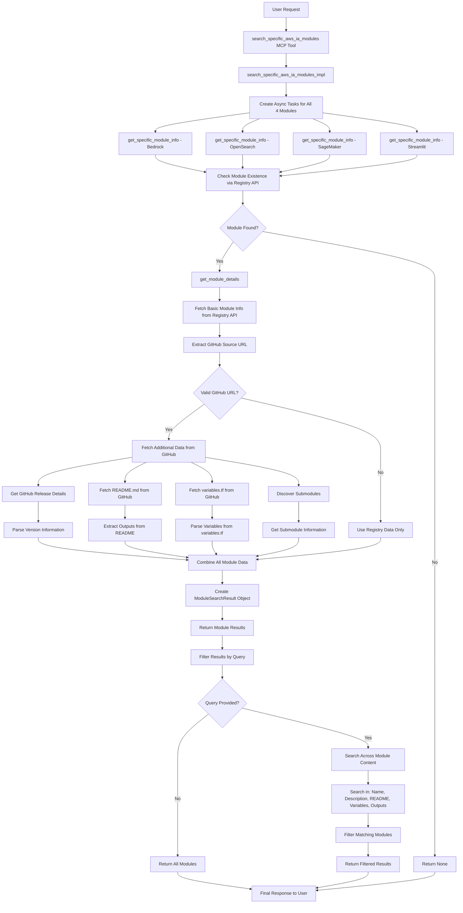

# AWS-IA Modules Search Tool - Workflow Diagram

## Overview
This tool searches for information about four specific AWS-IA Terraform modules by fetching data from the Terraform Registry API and GitHub repositories. It provides comprehensive details about these modules including README content, variables, outputs, and submodules.

## Target Modules
The tool specifically searches for these four AWS-IA modules:
- `aws-ia/bedrock/aws` - Amazon Bedrock module for generative AI applications
- `aws-ia/opensearch-serverless/aws` - OpenSearch Serverless collection for vector search
- `aws-ia/sagemaker-endpoint/aws` - SageMaker endpoint deployment module
- `aws-ia/serverless-streamlit-app/aws` - Serverless Streamlit application deployment

## Architecture & Workflow



## Detailed Logic Flow

### 1. **Entry Point & Task Creation**
```python
@mcp.tool(name='SearchSpecificAwsIaModules')
async def search_specific_aws_ia_modules(
    query: str
) -> List[ModuleSearchResult]:
    return await search_specific_aws_ia_modules_impl(query)
```

### 2. **Core Implementation Logic**
```python
async def search_specific_aws_ia_modules_impl(query: str):
    # 1. Create async tasks for all 4 modules
    # 2. Run tasks concurrently using asyncio.gather()
    # 3. Filter results based on query
    # 4. Return matching modules
```

### 3. **Module Information Fetching**
```python
async def get_specific_module_info(module_info: Dict[str, str]):
    # 1. Check if module exists via Registry API
    # 2. Get basic module information
    # 3. Fetch detailed information including README
    # 4. Create ModuleSearchResult object
```

### 4. **Detailed Module Data Collection**
```python
async def get_module_details(namespace: str, name: str, provider: str):
    # 1. Fetch basic info from Terraform Registry API
    # 2. Extract GitHub source URL
    # 3. Fetch README content from GitHub
    # 4. Parse variables.tf file
    # 5. Discover submodules
    # 6. Get version details from GitHub releases
    # 7. Extract outputs from README
```

## Key Design Patterns

### 1. **Concurrent Processing**
- **Async tasks**: Uses `asyncio.gather()` to fetch all 4 modules simultaneously
- **Parallel execution**: All module information is fetched concurrently for better performance
- **Error isolation**: If one module fails, others continue processing

### 2. **Multi-Source Data Collection**
- **Terraform Registry API**: Primary source for basic module information
- **GitHub API**: Secondary source for detailed content (README, variables.tf, releases)
- **Fallback mechanisms**: Graceful degradation if GitHub data is unavailable

### 3. **Content Parsing & Extraction**
- **README parsing**: Extracts outputs and descriptions from markdown content
- **variables.tf parsing**: Parses Terraform variable definitions
- **Submodule discovery**: Finds and analyzes submodules in the repository

### 4. **Flexible Search**
- **Query filtering**: Searches across multiple content types
- **Multi-term search**: Splits query into terms for flexible matching
- **Content aggregation**: Combines all module content for comprehensive search

## Data Flow

### Input Processing
1. **Query**: Optional search term to filter modules
2. **Module List**: Hardcoded list of 4 specific AWS-IA modules
3. **Validation**: Ensures valid module references

### Registry API Integration
1. **Module Existence Check**: `https://registry.terraform.io/v1/modules/{namespace}/{name}/{provider}`
2. **Basic Information**: Name, description, version, source URL
3. **Error Handling**: Graceful handling of missing modules

### GitHub Integration
1. **Source URL Extraction**: Parse GitHub URL from registry data
2. **Content Fetching**: README.md, variables.tf, releases
3. **Branch Handling**: Try 'main' first, fallback to 'master'
4. **Raw Content**: Use raw.githubusercontent.com for direct file access

### Content Processing
1. **README Analysis**: Extract outputs and descriptions
2. **Variables Parsing**: Parse Terraform variable definitions
3. **Submodule Discovery**: Find and analyze submodules
4. **Version Information**: Extract from GitHub releases

### Output Structuring
```python
ModuleSearchResult(
    name="bedrock",
    namespace="aws-ia",
    provider="aws",
    version="1.0.0",
    description="Amazon Bedrock module for generative AI applications",
    url="https://registry.terraform.io/modules/aws-ia/bedrock/aws",
    readme_content="...",
    variables=[TerraformVariable(...)],
    outputs=[TerraformOutput(...)],
    submodules=[SubmoduleInfo(...)],
    version_details={...}
)
```

## Search Logic

### Query Processing
1. **Term Splitting**: Split query into individual terms
2. **Content Aggregation**: Combine all searchable content
3. **Multi-field Search**: Search across name, description, README, variables, outputs
4. **Case-insensitive**: Convert all content to lowercase for matching

### Searchable Content
- **Module name**: Direct name matching
- **Description**: Module description from registry
- **README content**: Full README text
- **Variable names**: Variable names from variables.tf
- **Variable descriptions**: Variable descriptions and types
- **Output names**: Output names from README
- **Output descriptions**: Output descriptions

## Performance Optimizations

1. **Concurrent Fetching**: All modules fetched simultaneously
2. **Caching**: Registry API responses cached implicitly
3. **Timeout Handling**: HTTP requests with timeouts
4. **Content Truncation**: README content truncated if too large (>8000 chars)

## Error Handling

1. **Module Not Found**: Graceful handling of missing modules
2. **GitHub Unavailable**: Fallback to registry-only data
3. **Network Errors**: Timeout and connection error handling
4. **Parsing Errors**: Partial results with error logging

## Key Features

1. **Specific Module Focus**: Targets only 4 key AWS-IA modules
2. **Comprehensive Data**: README, variables, outputs, submodules, versions
3. **Flexible Search**: Query-based filtering across all content
4. **Real-time Data**: Fetches latest information from registry and GitHub
5. **Structured Output**: Well-defined result objects with all module details

This architecture provides a focused, efficient solution for searching specific AWS-IA modules with comprehensive information gathering and flexible query capabilities. 