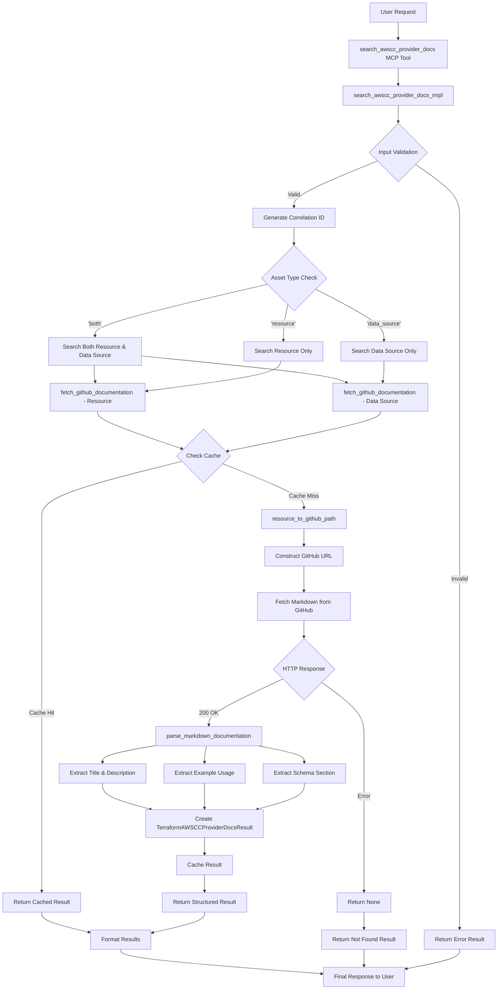

# AWSCC Provider Documentation Search Tool - Workflow Diagram

## Overview
This tool searches the Terraform AWSCC provider documentation by fetching content directly from the official GitHub repository and parsing markdown files to extract structured information about AWSCC resources and data sources. AWSCC (AWS Cloud Control) is a newer provider that offers a more consistent interface to AWS resources compared to the standard AWS provider.

## Architecture & Workflow



## Detailed Logic Flow

### 1. **Entry Point & Validation**
```python
@mcp.tool(name='SearchAwsccProviderDocs')
async def search_awscc_provider_docs(
    asset_name: str,
    asset_type: str = 'resource'
) -> List[TerraformAWSCCProviderDocsResult]:
    return await search_awscc_provider_docs_impl(asset_name, asset_type)
```

### 2. **Core Implementation Logic**
```python
async def search_awscc_provider_docs_impl(
    asset_name: str, 
    asset_type: str = 'resource', 
    cache_enabled: bool = False
):
    # 1. Input validation
    # 2. Generate correlation ID for logging
    # 3. Determine search strategy based on asset_type
    # 4. Fetch documentation from GitHub
    # 5. Parse and structure results
    # 6. Return formatted results
```

### 3. **GitHub Path Construction (AWSCC Specific)**
```python
def resource_to_github_path(asset_name: str, asset_type: str):
    # 1. Sanitize input (prevent path traversal)
    # 2. Remove 'awscc_' prefix if present (6 characters)
    # 3. Determine document type ('resources' or 'data-sources')
    # 4. Construct file path: {doc_type}/{resource_name}.md
    # 5. Build full GitHub raw URL
```

### 4. **Documentation Fetching**
```python
def fetch_github_documentation(asset_name: str, asset_type: str, cache_enabled: bool):
    # 1. Check in-memory cache first
    # 2. Construct GitHub URL using resource_to_github_path
    # 3. Make HTTP request to GitHub raw content
    # 4. Handle timeouts and errors
    # 5. Cache successful results
    # 6. Parse markdown content
```

### 5. **Markdown Parsing (AWSCC Specific)**
```python
def parse_markdown_documentation(content: str, asset_name: str, url: str):
    # 1. Extract title from first heading
    # 2. Extract description from resource section
    # 3. Parse Example Usage section for code snippets
    # 4. Parse Schema section for combined arguments/attributes
    # 5. Return structured dictionary with schema_arguments
```

## Key Design Patterns

### 1. **Caching Strategy**
- **In-memory cache**: `_GITHUB_DOC_CACHE` dictionary
- **Cache key**: `{asset_name}_{asset_type}`
- **Cache invalidation**: Manual (no automatic expiration)

### 2. **Error Handling**
- **Input validation**: Sanitize asset names, validate asset types
- **Network errors**: Handle timeouts and HTTP errors gracefully
- **Parsing errors**: Return partial results with error descriptions
- **Security**: Prevent path traversal attacks

### 3. **Logging & Observability**
- **Correlation IDs**: Track requests across function calls
- **Structured logging**: Use loguru with detailed formatting
- **Performance metrics**: Track execution times
- **Error tracking**: Log errors without exposing sensitive data

### 4. **Flexible Search Strategy**
- **Asset type handling**: Support 'resource', 'data_source', or 'both'
- **Prefix handling**: Automatically handle 'awscc_' prefix
- **Fallback mechanisms**: Try multiple paths for comprehensive results

## Data Flow

### Input Processing
1. **Asset Name**: `awscc_s3_bucket` → `s3_bucket` (prefix removal)
2. **Asset Type**: Determines GitHub path construction
3. **Validation**: Ensures safe input parameters

### GitHub Integration (AWSCC Specific)
1. **URL Construction**: `https://raw.githubusercontent.com/hashicorp/terraform-provider-awscc/main/docs/resources/s3_bucket.md`
2. **Content Fetching**: HTTP GET request with timeout
3. **Response Handling**: Status code validation

### Content Parsing (AWSCC Specific)
1. **Title Extraction**: First `#` heading
2. **Description**: Content after resource title
3. **Examples**: Code blocks in "Example Usage" section
4. **Schema**: Combined arguments/attributes in "Schema" section

### Output Structuring (AWSCC Specific)
```python
TerraformAWSCCProviderDocsResult(
    asset_name="awscc_s3_bucket",
    asset_type="resource",
    description="Provides a S3 bucket resource...",
    url="https://raw.githubusercontent.com/...",
    example_usage=[{"title": "Basic Usage", "code": "resource \"awscc_s3_bucket\"..."}],
    schema_arguments=[{"name": "bucket_name", "description": "Name of the bucket", "argument_section": "main"}]
)
```

## Key Differences from AWS Provider Tool

### 1. **Repository Structure**
- **AWS Provider**: `terraform-provider-aws/main/website/docs/r/`
- **AWSCC Provider**: `terraform-provider-awscc/main/docs/resources/`

### 2. **File Extensions**
- **AWS Provider**: `.html.markdown`
- **AWSCC Provider**: `.md`

### 3. **Documentation Sections**
- **AWS Provider**: Separate "Argument Reference" and "Attribute Reference"
- **AWSCC Provider**: Combined "Schema" section

### 4. **Prefix Handling**
- **AWS Provider**: Removes `aws_` (4 characters)
- **AWSCC Provider**: Removes `awscc_` (6 characters)

### 5. **Result Model**
- **AWS Provider**: Separate `arguments` and `attributes`
- **AWSCC Provider**: Combined `schema_arguments`

## Performance Optimizations

1. **Caching**: In-memory cache for repeated queries
2. **Parallel Processing**: When searching 'both' types
3. **Timeout Management**: 10-second timeout for GitHub requests
4. **Content Length Limits**: Preview logging for large responses

## Security Considerations

1. **Input Sanitization**: Regex validation for asset names
2. **Path Traversal Prevention**: URL construction validation
3. **Error Information**: Limited error details in responses
4. **Domain Validation**: Ensure URLs point to expected GitHub domain

## AWSCC Provider Benefits

1. **Consistent Interface**: More standardized resource definitions
2. **Cloud Control API**: Based on AWS Cloud Control API
3. **Modern Approach**: Newer provider with improved resource models
4. **Better Schema**: Combined schema information for easier understanding

This architecture provides a robust, scalable solution for searching AWSCC provider documentation with comprehensive error handling, caching, and structured output, specifically designed for the AWSCC provider's unique characteristics. 