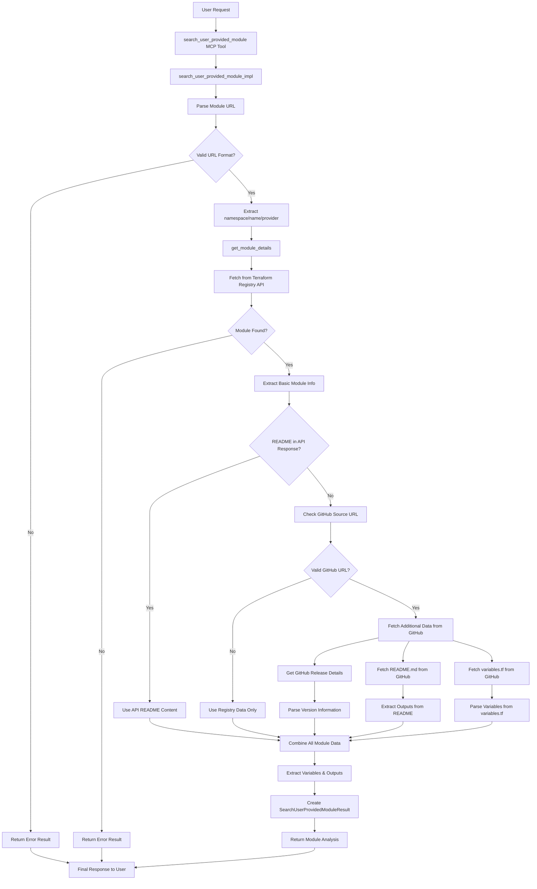

# User-Provided Module Search Tool - Workflow Diagram

## Overview
This tool analyzes any Terraform module from the Terraform Registry by fetching comprehensive information including variables, outputs, README content, and version details. It supports both specific versions and the latest version of modules.

## Architecture & Workflow



## Detailed Logic Flow

### 1. **Entry Point & Request Processing**
```python
@mcp.tool(name='SearchUserProvidedModule')
async def search_user_provided_module(
    module_url: str,
    version: Optional[str] = None,
    variables: Optional[Dict[str, Any]] = None
) -> SearchUserProvidedModuleResult:
    request = SearchUserProvidedModuleRequest(
        module_url=module_url,
        version=version,
        variables=variables,
    )
    return await search_user_provided_module_impl(request)
```

### 2. **URL Parsing & Validation**
```python
def parse_module_url(module_url: str) -> Optional[Tuple[str, str, str]]:
    # 1. Handle registry.terraform.io URLs
    # 2. Handle simple namespace/name/provider format
    # 3. Extract namespace, name, and provider
    # 4. Validate format and return tuple
```

### 3. **Module Details Fetching**
```python
async def get_module_details(namespace: str, name: str, provider: str, version: Optional[str] = None):
    # 1. Construct Registry API URL
    # 2. Fetch basic module information
    # 3. Extract GitHub source URL if available
    # 4. Fetch additional content from GitHub
    # 5. Parse and combine all data
```

### 4. **Content Extraction & Processing**
```python
# Extract variables from multiple sources:
# 1. Registry API variables data
# 2. GitHub variables.tf file
# 3. Registry API root.inputs format

# Extract outputs from multiple sources:
# 1. Registry API outputs data
# 2. GitHub README.md parsing
# 3. Registry API root.outputs format
```

## Key Design Patterns

### 1. **Flexible URL Parsing**
- **Registry URLs**: `registry.terraform.io/namespace/name/provider`
- **Simple URLs**: `namespace/name/provider`
- **Version Support**: Optional version specification
- **Error Handling**: Graceful handling of invalid URLs

### 2. **Multi-Source Data Collection**
- **Terraform Registry API**: Primary source for basic module information
- **GitHub Integration**: Secondary source for detailed content
- **Fallback Mechanisms**: Registry-only data if GitHub unavailable
- **Branch Handling**: Try 'main' first, fallback to 'master'

### 3. **Content Extraction Strategies**
- **README Content**: Direct API response or GitHub raw content
- **Variables**: Multiple parsing strategies for different formats
- **Outputs**: Registry API or README parsing
- **Version Information**: Registry API or GitHub releases

### 4. **Error Resilience**
- **Module Not Found**: Clear error messages with suggestions
- **Network Failures**: Graceful degradation to available data
- **Parsing Errors**: Partial results with error logging
- **Invalid URLs**: Detailed format guidance

## Data Flow

### Input Processing
1. **Module URL**: Parse and validate module identifier
2. **Version**: Optional specific version to analyze
3. **Variables**: Optional variables for analysis context

### Registry API Integration
1. **Module Lookup**: `https://registry.terraform.io/v1/modules/{namespace}/{name}/{provider}`
2. **Version Support**: Append version to URL if specified
3. **Basic Information**: Name, description, version, source URL
4. **Variables/Outputs**: Extract from registry API format

### GitHub Integration
1. **Source URL Extraction**: Parse GitHub URL from registry data
2. **Content Fetching**: README.md, variables.tf, releases
3. **Branch Strategy**: Try 'main' first, fallback to 'master'
4. **Raw Content**: Use raw.githubusercontent.com for direct access

### Content Processing
1. **README Analysis**: Extract outputs and descriptions
2. **Variables Parsing**: Parse Terraform variable definitions
3. **Version Information**: Extract from GitHub releases
4. **Content Truncation**: Limit README to 8000 characters

### Output Structuring
```python
SearchUserProvidedModuleResult(
    status="success",
    module_name="consul",
    module_url="hashicorp/consul/aws",
    module_version="1.0.0",
    module_description="Terraform module for Consul on AWS",
    variables=[TerraformVariable(...)],
    outputs=[TerraformOutput(...)],
    readme_content="...",
    error_message=None
)
```

## URL Format Support

### Supported Formats:
1. **Simple Format**: `hashicorp/consul/aws`
2. **Registry URL**: `registry.terraform.io/hashicorp/consul/aws`
3. **Full URL**: `https://registry.terraform.io/hashicorp/consul/aws`
4. **With Version**: `hashicorp/consul/aws/1.0.0`

### URL Parsing Logic:
```python
# Handle different URL formats
if '://' in module_url:
    parsed_url = urlparse(module_url)
else:
    parsed_url = urlparse(f'https://{module_url}')

# Extract namespace/name/provider
if parsed_url.netloc == 'registry.terraform.io':
    path = parsed_url.path.lstrip('/')
    parts = path.split('/')
else:
    parts = module_url.split('/')
```

## Content Extraction Strategies

### Variables Extraction:
1. **Registry API Variables**: Direct from API response
2. **Registry API Root Inputs**: Parse from root.inputs format
3. **GitHub variables.tf**: Parse Terraform variable definitions
4. **Fallback**: Empty list if no variables found

### Outputs Extraction:
1. **Registry API Outputs**: Direct from API response
2. **Registry API Root Outputs**: Parse from root.outputs format
3. **README Parsing**: Extract outputs from README content
4. **Fallback**: Empty list if no outputs found

### README Content:
1. **Registry API**: Direct README content if available
2. **GitHub Raw**: Fetch from raw.githubusercontent.com
3. **Branch Strategy**: Try 'main', fallback to 'master'
4. **Content Truncation**: Limit to 8000 characters

## Performance Optimizations

1. **Efficient URL Parsing**: Single-pass URL parsing
2. **Conditional Fetching**: Only fetch GitHub data if needed
3. **Content Truncation**: Limit large README content
4. **Error Isolation**: Continue processing if one source fails

## Error Handling

1. **Invalid URL Format**: Clear error message with expected format
2. **Module Not Found**: Registry API error handling
3. **GitHub Unavailable**: Fallback to registry-only data
4. **Network Errors**: Timeout and connection error handling
5. **Parsing Errors**: Partial results with error logging

## Key Features

1. **Universal Module Support**: Any module from Terraform Registry
2. **Version Flexibility**: Latest or specific version analysis
3. **Comprehensive Data**: Variables, outputs, README, version details
4. **Flexible URL Formats**: Multiple URL format support
5. **Robust Error Handling**: Graceful degradation and clear error messages
6. **Multi-source Data**: Registry API + GitHub integration

## Use Cases

1. **Module Analysis**: Understand any Terraform module structure
2. **Version Comparison**: Analyze specific module versions
3. **Documentation Review**: Get comprehensive module documentation
4. **Variable Discovery**: Find all available input variables
5. **Output Discovery**: Find all available output values
6. **Module Evaluation**: Assess module quality and completeness

This architecture provides a flexible, robust solution for analyzing any Terraform module from the registry with comprehensive information gathering and multiple fallback strategies. 